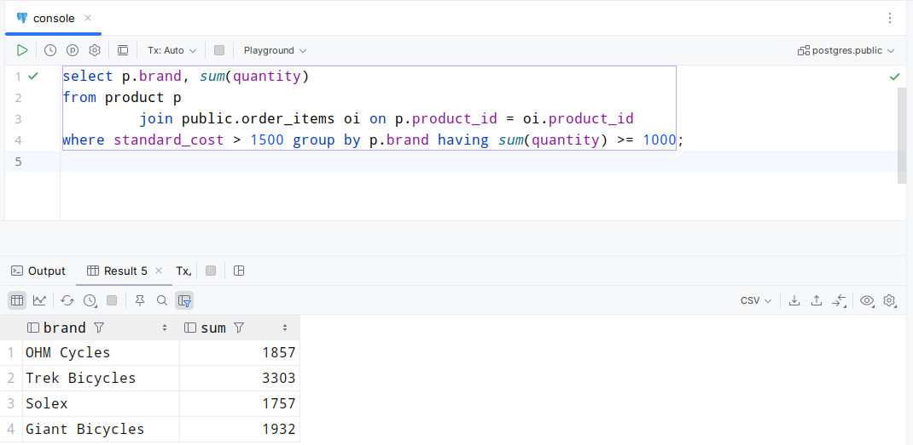
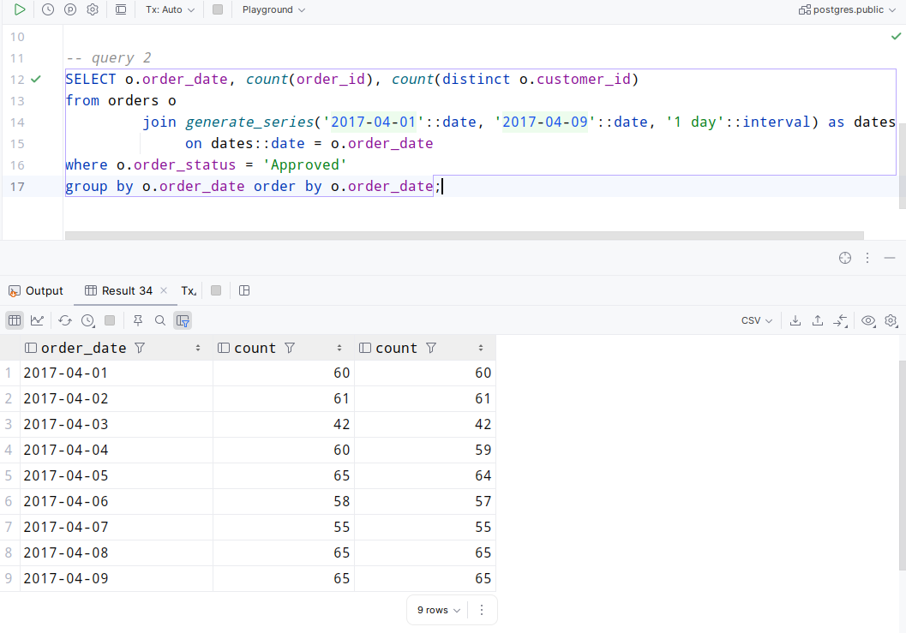
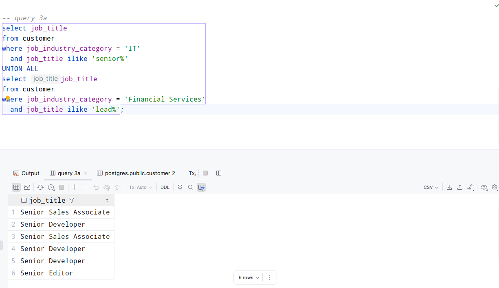
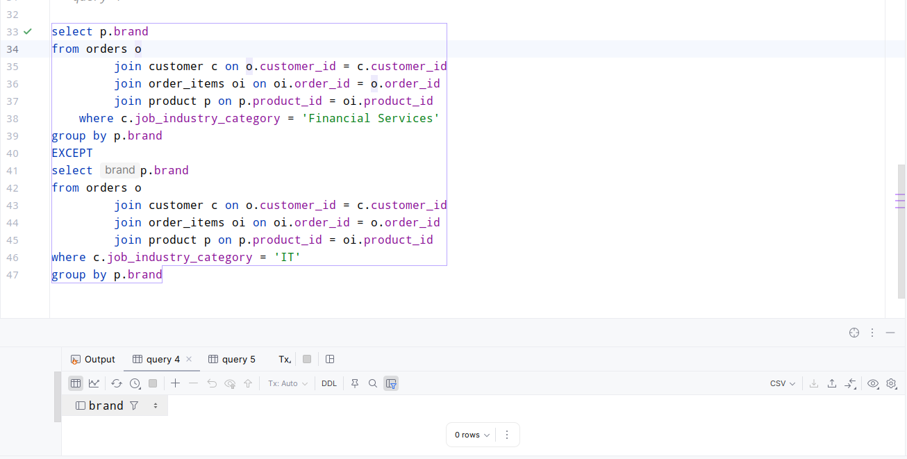
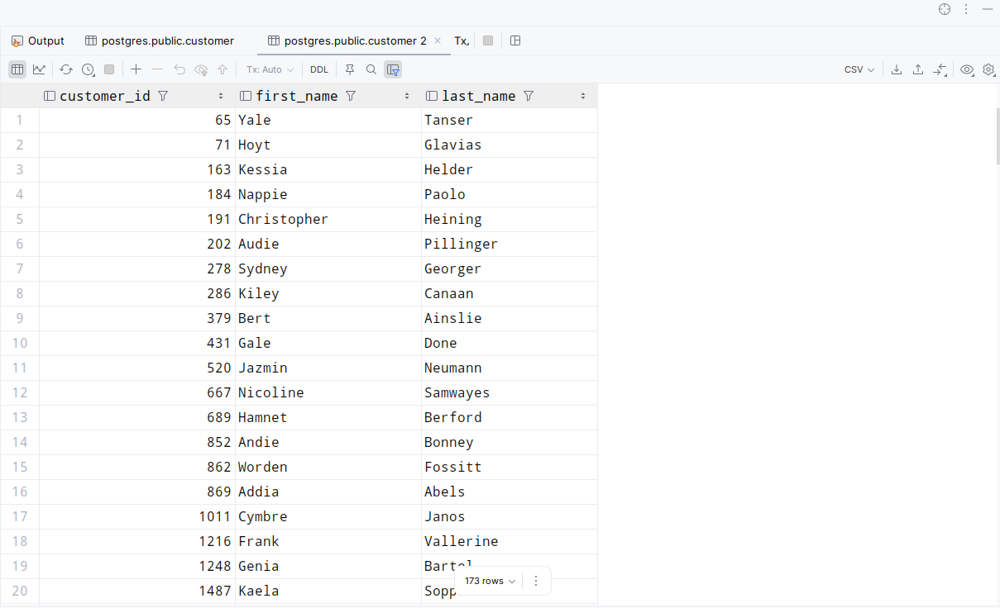

# HW 2

1) Вывести все уникальные бренды, у которых есть хотя бы один продукт со стандартной стоимостью выше 1500 долларов, и
   суммарными продажами не менее 1000 единиц.

```sql
select p.brand, sum(quantity)
from product p
         join public.order_items oi on p.product_id = oi.product_id
where standard_cost > 1500
group by p.brand
having sum(quantity) >= 1000;
```


2) Для каждого дня в диапазоне с 2017-04-01 по 2017-04-09 включительно вывести количество подтвержденных онлайн-заказов
   и количество уникальных клиентов, совершивших эти заказы.

```sql
SELECT o.order_date, count(order_id), count(distinct o.customer_id)
from orders o
         join generate_series('2017-04-01'::date, '2017-04-09'::date, '1 day'::interval) as dates
              on dates::date = o.order_date
where o.order_status = 'Approved'
group by o.order_date
order by o.order_date;
```


3) Вывести профессии клиентов:

- из сферы IT, чья профессия начинается с Senior;
- из сферы Financial Services, чья профессия начинается с Lead.
  Для обеих групп учитывать только клиентов старше 35 лет. Объединить выборки с помощью UNION ALL.
```sql
select job_title
from customer
where job_industry_category = 'IT'
  and job_title ilike 'senior%'
  and extract(year from age(dob::date)) > 35
UNION ALL
select job_title
from customer
where job_industry_category = 'Financial Services'
  and extract(year from age(dob::date)) > 35
  and job_title ilike 'lead%';
```


4) Вывести бренды, которые были куплены клиентами из сферы Financial Services, но не были куплены клиентами из сферы IT.
```sql
select p.brand
from orders o
         join customer c on o.customer_id = c.customer_id
         join order_items oi on oi.order_id = o.order_id
         join product p on p.product_id = oi.product_id
    where c.job_industry_category = 'Financial Services'
group by p.brand
EXCEPT
select p.brand
from orders o
         join customer c on o.customer_id = c.customer_id
         join order_items oi on oi.order_id = o.order_id
         join product p on p.product_id = oi.product_id
where c.job_industry_category = 'IT'
group by p.brand
```

5) Вывести 10 клиентов (ID, имя, фамилия), которые совершили наибольшее количество онлайн-заказов (в штуках) брендов
   Giant Bicycles, Norco Bicycles, Trek Bicycles, при условии, что они активны и имеют оценку имущества (
   property_valuation) выше среднего среди клиентов из того же штата.
```sql
select c.customer_id, c.first_name, c.last_name, count(o.order_id) as count_o
from customer c
         join orders o on o.customer_id = c.customer_id
where o.order_id in (select oi.order_id
                     from order_items oi
                              join product p on oi.product_id = p.product_id
                     where p.brand in ('Giant Bicycles', 'Norco Bicycles', 'Trek Bicycles'))
  and c.deceased_indicator = 'N'
  and o.online_order = 'True'
  and c.property_valuation >
      (select avg(cu.property_valuation) from customer cu where cu.state = c.state)
group by c.customer_id, c.first_name, c.last_name
order by count_o desc
limit 10;
```
6) Вывести всех клиентов (ID, имя, фамилия), у которых нет подтвержденных онлайн-заказов за последний год, но при этом
   они владеют автомобилем и их сегмент благосостояния не Mass Customer.
```sql
select c.customer_id, c.first_name, c.last_name
from customer c
where c.customer_id not in
      (select c1.customer_id
       from customer c1
                join orders o on c1.customer_id = o.customer_id
           and online_order = 'True'
           and order_status = 'Approved')
  and c.owns_car = 'Yes'
  and c.wealth_segment != 'Mass Customer'
order by c.customer_id;
```

7) Вывести всех клиентов из сферы 'IT' (ID, имя, фамилия), которые купили 2 из 5 продуктов с самой высокой list_price в
   продуктовой линейке Road.
```sql
select o.customer_id, c.first_name, c.last_name
from orders o
        join customer c on o.customer_id = c.customer_id
        join public.order_items oi on o.order_id = oi.order_id
where o.customer_id in (select c.customer_id
                        from customer c
                        where c.job_industry_category = 'IT')
  and oi.product_id in (select p1.product_id
                        from product p1
                        where p1.list_price = (select max(list_price) from product p where p.product_line = 'Road'))
group by  c.first_name, o.customer_id, c.last_name
having count(product_id) = 2
INTERSECT
select o.customer_id, c.first_name, c.last_name
from orders o
        join customer c on o.customer_id = c.customer_id
        join public.order_items oi on o.order_id = oi.order_id
where o.customer_id in (select c.customer_id
                        from customer c
                        where c.job_industry_category = 'IT')
  and oi.product_id in (select p1.product_id
                        from product p1
                        where p1.product_line = 'Road')
group by o.customer_id, c.first_name, c.last_name
having count(oi.product_id) >= 5;
```

8) Вывести клиентов (ID, имя, фамилия, сфера деятельности) из сфер IT или Health, которые совершили не менее 3
   подтвержденных заказов в период 2017-01-01 по 2017-03-01, и при этом их общий доход от этих заказов превышает 10 000
   долларов.
   Разделить вывод на две группы (IT и Health) с помощью UNION.
```sql
select c.customer_id, c.first_name, c.last_name, c.job_industry_category
from customer c
        join orders o on c.customer_id = o.customer_id
where c.job_industry_category = 'IT'
  and o.order_date between '2017-01-01'::date and '2017-03-01'::date
  and o.order_status = 'Approved'
group by c.customer_id, c.first_name, c.customer_id, c.last_name, c.job_industry_category
having count(o.order_id) >= 3
UNION
select c.customer_id, c.first_name, c.last_name, c.job_industry_category
from customer c
        join orders o on c.customer_id = o.customer_id
where c.job_industry_category = 'Health'
  and o.order_date between '2017-01-01'::date and '2017-03-01'::date
  and o.order_status = 'Approved'
group by c.customer_id, c.first_name, c.customer_id, c.last_name, c.job_industry_category
having count(o.order_id) >= 3;
-- Из условия задачи не понятно, из каких данных складывается доход... данное условие не добавлял
```